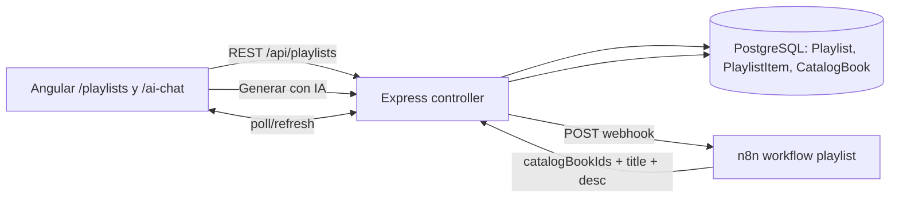

# Backlog Jira — Mejora IA (Playlists) + UX Chat

Este plan está pensado para convertirse directamente en issues de Jira (espacio SCRUM). Cada historia incluye: **Descripción**, **Criterios de aceptación (BDD Gherkin)**, **Notas técnicas**, **Archivos afectados** y **DoD**.

Convención de nombres (coherente con la skill `bookmatch-jira-workflow`):
- Tipo: `Historia` / `Subtarea` / `Tarea técnica`
- Prefijo título: `[AI-Playlists]` o `[AI-Chat]`
- Labels sugeridos: `frontend`, `backend`, `prisma`, `n8n`, `ux`, `i18n`, `docs`

Stack y decisiones ya acordadas:
- Playlists en **PostgreSQL vía Prisma** (modelos nuevos `Playlist` + `PlaylistItem` → `CatalogBook`).
- UI con **página dedicada `/playlists`** + integración desde `/ai-chat`.
- Incluye: compartir/exportar y marcar libros como leído/pendiente dentro de la playlist.
- Conversaciones del chat siguen en **Firestore** (no se migran); solo se añade rename/delete + rediseño.

---

## Épica 1 · [AI-Playlists] Playlists de libros con CRUD y generación por IA

**Objetivo:** permitir al usuario tener playlists de libros del catálogo, crearlas manualmente o pedir a la IA que las genere, editarlas (añadir/quitar/reordenar), marcarlas como públicas/privadas y consumirlas desde el chat.

**Modelo de datos previsto (a implementar en H1.1):**

```prisma
model Playlist {
  id          Int             @id @default(autoincrement())
  ownerId     Int
  owner       User            @relation(fields: [ownerId], references: [id], onDelete: Cascade)
  title       String
  description String?
  coverUrl    String?
  visibility  PlaylistVisibility @default(PRIVATE)
  source      PlaylistSource     @default(MANUAL)
  aiPrompt    String?
  shareToken  String?         @unique
  items       PlaylistItem[]
  createdAt   DateTime        @default(now())
  updatedAt   DateTime        @updatedAt
  deletedAt   DateTime?
  @@index([ownerId])
}

model PlaylistItem {
  id            Int          @id @default(autoincrement())
  playlistId    Int
  playlist      Playlist     @relation(fields: [playlistId], references: [id], onDelete: Cascade)
  catalogBookId Int
  catalogBook   CatalogBook  @relation(fields: [catalogBookId], references: [id])
  position      Int
  status        ItemStatus   @default(PENDING)
  note          String?
  addedAt       DateTime     @default(now())
  @@unique([playlistId, catalogBookId])
  @@index([playlistId, position])
}

enum PlaylistVisibility { PRIVATE PUBLIC }
enum PlaylistSource     { MANUAL AI HYBRID }
enum ItemStatus         { PENDING READING READ }
```

### Arquitectura (alto nivel)



### Historias

#### H1.1 · [AI-Playlists] Modelos Prisma y migración

- **Descripción:** Añadir modelos `Playlist`, `PlaylistItem`, enums y relación inversa en `User` y `CatalogBook`. Crear migración y actualizar seed si aplica.
- **Archivos:** [BookMatch-Backend/prisma/schema.prisma](BookMatch-Backend/prisma/schema.prisma), nueva migración en `BookMatch-Backend/prisma/migrations/`, [BookMatch-Backend/prisma/seed.ts](BookMatch-Backend/prisma/seed.ts) (solo si existen datos demo).
- **Criterios de aceptación:**
  - `npx prisma migrate dev --name add_playlists` aplica sin errores en local.
  - `User` tiene relación `playlists Playlist[]`; `CatalogBook` tiene relación inversa `playlistItems PlaylistItem[]`.
  - `@@unique([playlistId, catalogBookId])` impide duplicar un libro en la misma playlist.
  - `shareToken` es único y nullable (solo se rellena al compartir).
- **DoD:** migración commiteada, `prisma generate` actualizado, tipos TS disponibles en backend.

#### H1.2 · [AI-Playlists] Endpoints REST CRUD de playlists

- **Descripción:** Crear módulo `playlists` en backend (patrón igual a `catalog-books`) con validación Zod y guardas `auth` + ownership.
- **Archivos nuevos:** `BookMatch-Backend/src/modules/playlists/playlists.routes.ts`, `playlists.controller.ts`, `playlists.service.ts`, `playlists.schemas.ts`. Registrar en [BookMatch-Backend/src/app.ts](BookMatch-Backend/src/app.ts) con `app.use('/api/playlists', playlistsRoutes)`.
- **Endpoints:**
  - `GET /api/playlists` — lista playlists del usuario (paginada, `?visibility`, `?source`).
  - `POST /api/playlists` — crear `{ title, description?, visibility?, coverUrl? }`.
  - `GET /api/playlists/:id` — detalle con `items` ordenados por `position`, populando `catalogBook`.
  - `PATCH /api/playlists/:id` — renombrar / editar descripción / cambiar visibilidad.
  - `DELETE /api/playlists/:id` — soft delete (`deletedAt`).
  - `POST /api/playlists/:id/items` — añadir libro `{ catalogBookId, position? }`.
  - `PATCH /api/playlists/:id/items/:itemId` — cambiar `status` / `note` / `position`.
  - `DELETE /api/playlists/:id/items/:itemId` — eliminar ítem.
  - `POST /api/playlists/:id/items/reorder` — `{ orderedIds: number[] }`.
- **Criterios de aceptación:**
  - Todas las rutas protegidas con middleware `auth` (validando Firebase ID token como hace `catalog-books` admin).
  - Un usuario no puede leer/modificar playlists ajenas (responde `403`), salvo `GET /api/playlists/share/:token` (H1.6).
  - Validación Zod rechaza payloads inválidos con `400` y mensaje claro.
  - Reordenación es atómica (transacción Prisma).
  - Cobertura mínima con tests de integración para `POST`, `GET`, `PATCH`, `DELETE` playlist e ítem (Jest + supertest, siguiendo patrón existente).
- **DoD:** Swagger actualizado si el backend lo usa; endpoints respondiendo `2xx`/`4xx` según contrato.

#### H1.3 · [AI-Playlists] Endpoint de generación por IA + integración n8n

- **Descripción:** Nuevo endpoint `POST /api/playlists/generate` que recibe `{ prompt, size?, mood?, genres? }`, delega en n8n (con los `CatalogBook` disponibles) y devuelve una playlist persistida con `source = AI`.
- **Flujo:**
  1. Controller valida input y crea `Playlist` en estado `draft` (p.ej. `title = 'Generando...'`, marcar con `aiPrompt`).
  2. POST a `env.N8N_WEBHOOK_PLAYLIST_URL` con `{ playlistId, prompt, catalogSample, baseUrl }`.
  3. n8n devuelve (webhook de retorno o polling) `{ title, description, items: [{ catalogBookId, position, note? }] }`.
  4. Endpoint callback `POST /api/playlists/:id/ai-complete` (protegido con secret compartido) rellena items, actualiza título y descripción.
- **Archivos:** `playlists.controller.ts`, `playlists.service.ts`, nueva var en [BookMatch-Backend/src/config/env.ts](BookMatch-Backend/src/config/env.ts) (`N8N_WEBHOOK_PLAYLIST_URL`, `N8N_CALLBACK_SECRET`). Documentar en `env.production.example`.
- **Criterios de aceptación:**
  - Si `N8N_WEBHOOK_PLAYLIST_URL` no está configurada → `503` con mensaje claro (igual que en [BookMatch-Backend/src/routes/ai-chat.routes.ts](BookMatch-Backend/src/routes/ai-chat.routes.ts)).
  - El endpoint `ai-complete` valida header `x-n8n-secret`.
  - Los libros devueltos por la IA que no existan en `CatalogBook` se descartan silenciosamente y se registran en logs.
  - Si la IA falla, la playlist queda con `source = AI` y sin items, con flag `status` en descripción (decidir en refinement) para que el frontend muestre error reintentable.
- **DoD:** Workflow de n8n exportado a `docs/n8n/playlist-workflow.json` (o enlace Confluence).

#### H1.4 · [AI-Playlists] Compartir / exportar playlist

- **Descripción:** Permitir generar `shareToken`, desactivar compartir, y exportar a JSON/Markdown.
- **Endpoints:**
  - `POST /api/playlists/:id/share` → genera/rota `shareToken` y devuelve URL pública `/public/playlists/:token`.
  - `DELETE /api/playlists/:id/share` → invalida token.
  - `GET /api/playlists/share/:token` → público, sin auth, solo si `visibility = PUBLIC` y `deletedAt` nulo.
  - `GET /api/playlists/:id/export?format=json|md` → descarga.
- **Criterios de aceptación:**
  - Token con entropía ≥ 128 bits (`crypto.randomBytes(24).toString('base64url')`).
  - La URL pública no expone `ownerId`, solo datos de libros y playlist.
  - Export Markdown incluye título, descripción, y lista `- *Autor* — **Título** (estado)`.
- **DoD:** Endpoint público servido desde la misma app sin leakear datos internos.

#### H1.5 · [AI-Playlists] Frontend: `PlaylistService` + modelos TS

- **Descripción:** Crear `PlaylistService` con métodos CRUD usando `HttpClient` y `firstValueFrom`, y modelos TS alineados con los DTO del backend.
- **Archivos nuevos:** `BookMatch-Angular/src/app/core/services/playlist.service.ts`, `BookMatch-Angular/src/app/shared/models/playlist.model.ts`.
- **Criterios de aceptación:**
  - Tipos `Playlist`, `PlaylistItem`, `PlaylistVisibility`, `PlaylistSource`, `ItemStatus` exportados.
  - Métodos: `list()`, `get(id)`, `create()`, `update()`, `remove()`, `addItem()`, `updateItem()`, `removeItem()`, `reorder()`, `generateWithAi(prompt)`, `share()`, `unshare()`, `getByToken()`, `export(id, format)`.
  - `environment.apiUrl + '/playlists'`.
- **DoD:** Import paths coherentes con el resto del repo; sin dependencias innecesarias.

#### H1.6 · [AI-Playlists] Frontend: ruta `/playlists` (listado) y layout

- **Descripción:** Nueva feature standalone con lista de playlists del usuario, tarjetas con portada/auto-collage, filtros `Mías / Con IA / Manuales` y botones `Crear manual` + `Generar con IA`.
- **Archivos nuevos:** `BookMatch-Angular/src/app/features/playlists/playlists-list.component.{ts,html,scss}`. Registrar ruta lazy en [BookMatch-Angular/src/app/app.routes.ts](BookMatch-Angular/src/app/app.routes.ts) con `authGuard`.
- **Criterios de aceptación:**
  - Uso de `signals` y `@for` con `track`.
  - Estilo con **Tailwind primero** (coherente con AGENTS.md: "Tailwind antes que SCSS"). Solo SCSS para transiciones específicas.
  - Estados: cargando (skeleton), vacío (CTA), lista.
  - Responsive (grid 1/2/3 columnas según breakpoint).
- **DoD:** Link añadido al menú del [header.html](BookMatch-Angular/src/app/shared/components/header/header.html).

#### H1.7 · [AI-Playlists] Frontend: detalle/edición `/playlists/:id`

- **Descripción:** Vista detalle con: cabecera editable inline (título, descripción, visibilidad), lista de items con drag&drop (CDK), selector de estado por ítem (`PENDING/READING/READ`), nota por ítem, botón eliminar, buscador para añadir libros desde `CatalogBook`.
- **Archivos nuevos:** `BookMatch-Angular/src/app/features/playlists/playlist-detail.component.{ts,html,scss}`, reutiliza buscador de [CatalogService](BookMatch-Angular/src/app/core/services/catalog.service.ts).
- **Dependencia:** `@angular/cdk/drag-drop` (verificar si ya está instalado, si no añadirlo).
- **Criterios de aceptación:**
  - Al arrastrar un ítem, persiste via `reorder()` con debounce 300ms.
  - Cambio de estado se guarda optimista (con rollback si falla).
  - Buscador de libros usa `CatalogService.searchBooks` o equivalente con paginación.
  - No se pueden añadir libros duplicados (error visual).
- **DoD:** Accesible desde la lista y desde el chat (H1.10).

#### H1.8 · [AI-Playlists] Frontend: creación manual `/playlists/new`

- **Descripción:** Formulario mínimo para crear playlist vacía: título, descripción, visibilidad. Redirige a `/playlists/:id` tras crear.
- **Archivos:** `BookMatch-Angular/src/app/features/playlists/playlist-new.component.{ts,html,scss}`, reusar validaciones reactivas.
- **Criterios de aceptación:** Validación `title` requerido (≥3, ≤80 chars). Botón deshabilitado si formulario inválido.

#### H1.9 · [AI-Playlists] Frontend: diálogo "Generar con IA"

- **Descripción:** Modal con textarea de prompt + campos opcionales (`size`, `género`, `estado de ánimo`). Al enviar, muestra progreso y redirige al detalle cuando el callback completa los items (o polling cada 3s).
- **Archivos:** `BookMatch-Angular/src/app/features/playlists/playlist-generate-dialog.component.{ts,html,scss}`.
- **Criterios de aceptación:**
  - Timeout de polling a 60s con mensaje de error reintentable.
  - Al completar, muestra resumen ("La IA propuso N libros, todos del catálogo") y permite aceptar/descartar.
  - Si el usuario descarta antes de completar, `DELETE` la playlist en borrador.

#### H1.10 · [AI-Playlists] Integración desde `/ai-chat`

- **Descripción:** Cuando la respuesta del asistente incluya `metadata.recommendations` (ya previsto en [conversation.model.ts](BookMatch-Angular/src/app/core/models/conversation.model.ts)), mostrar botón **"Guardar como playlist"**; crea playlist con esos `catalogBookId` en una sola llamada.
- **Cambios contrato n8n:** que el workflow de chat rellene `metadata.recommendations` con ids numéricos de `CatalogBook` (no strings).
- **Archivos:** [ai-chat.component.html](BookMatch-Angular/src/app/features/ai-chat/ai-chat.component.html), [ai-chat.component.ts](BookMatch-Angular/src/app/features/ai-chat/ai-chat.component.ts), `playlist.service.ts`.
- **Criterios de aceptación:**
  - Botón visible solo si `metadata.recommendations.length > 0`.
  - Tras guardar, toast con enlace a `/playlists/:id`.

#### H1.11 · [AI-Playlists] Compartir y exportar (frontend)

- **Descripción:** Menú contextual en detalle y listado: `Compartir` (genera token + copia URL), `Dejar de compartir`, `Exportar → Markdown/JSON`.
- **Criterios de aceptación:**
  - URL pública abrible en incógnito sin login.
  - Export descarga archivo con `Content-Disposition`.

#### H1.12 · [AI-Playlists] i18n y traducciones

- **Descripción:** Añadir bloque `PLAYLISTS` en [es.json](BookMatch-Angular/src/assets/i18n/es.json) y [en.json](BookMatch-Angular/src/assets/i18n/en.json) (títulos, CTAs, estados, mensajes de error IA, confirmaciones).
- **Criterios de aceptación:** No queda texto hardcodeado en componentes de la feature; `TranslateModule` importado donde haga falta.

#### H1.13 · [AI-Playlists] Documentación en Confluence + Changelog

- **Descripción:** Documentar en el espacio PM (skill `bookmatch-confluence-docs`) la feature completa: contrato API, modelo Prisma, diagrama de flujo, capturas UI y guía de uso.
- **Criterios de aceptación:** Página publicada, `Changelog Reciente` actualizado, enlace añadido en `README.md` si procede.

---

## Épica 2 · [AI-Chat] Mejoras UX del chat con IA

**Objetivo:** que `/ai-chat` permita renombrar y eliminar conversaciones, tenga una interfaz estéticamente mejor (Tailwind coherente con el resto de la app), esté internacionalizada y unifique/aclarar el modal paralelo.

### Historias

#### H2.1 · [AI-Chat] Renombrar conversación desde el sidebar

- **Descripción:** Añadir edición inline del título (doble clic o icono lápiz) que persiste en Firestore vía `ConversationService`.
- **Archivos:** [BookMatch-Angular/src/app/core/services/conversation.service.ts](BookMatch-Angular/src/app/core/services/conversation.service.ts) (añadir `updateTitle(uid, id, title)`), [ai-chat.component.html](BookMatch-Angular/src/app/features/ai-chat/ai-chat.component.html), [ai-chat.component.ts](BookMatch-Angular/src/app/features/ai-chat/ai-chat.component.ts).
- **Criterios de aceptación:**
  - Título vacío o >80 chars → se cancela sin tocar Firestore.
  - Enter guarda, Esc cancela, click fuera guarda.
  - Se actualiza inmediatamente en la lista (Firestore `collectionData` ya es reactivo).
- **DoD:** Incluir keys i18n.

#### H2.2 · [AI-Chat] Eliminar / archivar conversación

- **Descripción:** Usar el método `archiveConversation` existente (ya definido y sin uso) con confirmación modal antes de borrar. Al archivar la conversación activa, seleccionar la siguiente o volver al estado "new empty".
- **Archivos:** `conversation.service.ts`, `ai-chat.component.{ts,html}`, confirmar si hay `ConfirmDialogComponent` reutilizable en `shared/`; si no, crear uno mínimo.
- **Criterios de aceptación:**
  - Usuario pulsa icono papelera → modal "¿Seguro?" → al confirmar la conversación desaparece del sidebar.
  - Soft delete (`status = 'archived'`), no borrado físico.
  - Mensaje toast "Conversación eliminada" (coherente con patrón existente si lo hay).

#### H2.3 · [AI-Chat] Rediseño visual con Tailwind

- **Descripción:** Reescribir estilos migrando de SCSS denso en [ai-chat.component.scss](BookMatch-Angular/src/app/features/ai-chat/ai-chat.component.scss) a **Tailwind primero** (AGENTS.md). Mantener paleta `#FCF5E2` / `#E0A15E` (tokens del proyecto). Mejorar:
  - Burbujas de mensaje con mejor contraste, avatares (usuario vs IA).
  - Sidebar con agrupación por fecha (`Hoy`, `Ayer`, `Esta semana`, `Anteriores`).
  - Estado "IA pensando" con animación dots.
  - Input con auto-resize + botón enviar + chip "Generar playlist" si hay recomendaciones.
  - Modo oscuro respetando variables si existen en el resto del app.
- **Criterios de aceptación:**
  - El SCSS del componente queda mínimo (solo animaciones custom).
  - Funciona responsive (sidebar off-canvas en mobile).
  - Lighthouse accesibilidad ≥ 90 en esta página.

#### H2.4 · [AI-Chat] i18n del chat

- **Descripción:** Añadir bloque `AI_CHAT` en [es.json](BookMatch-Angular/src/assets/i18n/es.json) y [en.json](BookMatch-Angular/src/assets/i18n/en.json) y migrar los strings hardcodeados (header del menú `"Asistente de Recomendaciones"`, placeholders, botones, estados).
- **Archivos:** [header.html](BookMatch-Angular/src/app/shared/components/header/header.html), ai-chat component + html.

#### H2.5 · [AI-Chat] Hardening endpoint backend

- **Descripción:** Proteger [/api/ai-chat/send-message](BookMatch-Backend/src/routes/ai-chat.routes.ts) con middleware `auth` y validar que `userId` del body coincide con el `firebaseUid` del token (hoy **no está protegido**).
- **Archivos:** [ai-chat.routes.ts](BookMatch-Backend/src/routes/ai-chat.routes.ts).
- **Criterios de aceptación:**
  - Sin token → `401`.
  - Token de otro usuario → `403`.
  - Existen tests de integración cubriendo ambos casos.

#### H2.6 · [AI-Chat] Decidir y unificar el modal flotante

- **Descripción:** El modal flotante en [categories.html](BookMatch-Angular/src/app/features/categories/categories.html) usa otra ruta (n8n directo con URL hardcodeada en [ai-chat.service.ts](BookMatch-Angular/src/app/core/services/ai-chat.service.ts)). Decidir: (a) eliminar el modal y redirigir a `/ai-chat`, (b) reutilizar `ConversationService` en el modal, o (c) mantener ambos con bandera. Tarea técnica: documentar decisión en Confluence y aplicar.
- **Criterios de aceptación:** No queda ninguna URL hardcodeada de n8n en el frontend.

#### H2.7 · [AI-Chat] QA manual y bugfixes

- **Subtarea final** con checklist de humo: crear, renombrar, eliminar, enviar, recibir, recomendaciones, generar playlist desde chat, i18n EN/ES, móvil, oscuro.

---

## Reparto sugerido (equipo de 3: sergii / samuel / lucas)

- **Backend/Prisma** (Samuel u otro): H1.1, H1.2, H1.3, H1.4, H2.5.
- **Frontend Playlists** (Lucas): H1.5, H1.6, H1.7, H1.8, H1.9, H1.11, H1.12.
- **Frontend Chat + integración** (Sergii): H1.10, H2.1, H2.2, H2.3, H2.4, H2.6.
- **Transversal / docs / QA**: H1.13 y H2.7 se reparten según carga de sprint.

## Orden de implementación recomendado

1. H1.1 → H1.2 → H1.5 (desbloquea todo el front de playlists)
2. H1.6 → H1.8 → H1.7 (CRUD manual completo usable end-to-end)
3. H1.3 → H1.9 (generación IA)
4. H1.10 (integración chat↔playlist) — depende de H1.5, H1.7
5. H1.4 → H1.11 (compartir/exportar)
6. Épica 2 en paralelo: H2.1/H2.2 pronto; H2.3/H2.4 tras estabilizar; H2.5/H2.6 como hardening; H2.7 al cierre; H1.12 antes de merge a `develop`.
7. H1.13 al final como gate de "Definition of Done" de la épica.

## Siguientes pasos propuestos (al confirmar el plan)

- Crear las 2 épicas y las 20 historias en Jira con la skill `bookmatch-jira-workflow` (espacio SCRUM), etiquetadas por área y con estos criterios de aceptación copiados.
- Publicar página índice en Confluence con esta misma estructura y enlazarla al *hub* BookMatch.